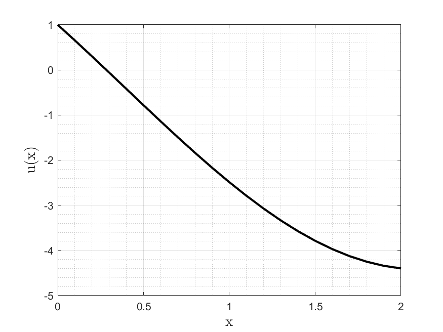

# differential-equations-fem-project
Acoustic Vibration Analysis of a Material Layer using Finite Element Method (FEM).

This project implements the Finite Element Method to solve the problem of acoustic vibrations in a material layer. It provides a numerical solution to the differential equation describing the vibration behavior of the layer, with specific boundary conditions.

## Project Overview

The project solves the following equation:

`-d²u/dx² - u = sin(x)`

with boundary conditions:

`u(0) = 1`  
`u'(2) - u(2) = 4`

where **u(x)** is the function describing the material layer’s acoustic vibration.

## Approach

### Variational Formulation

The equation is rewritten in its variational form by multiplying both sides by a test function **v(x)** and integrating over the domain **[0, 2]**. Integration by parts eliminates the second derivative.

The problem is then discretized using piecewise linear basis functions and the Galerkin method.

### Discretization

The domain **[0, 2]** is divided into **n** elements, and the solution is approximated as a combination of basis functions:

`u(x) = ∑(i=1 to n) wᵢ eᵢ(x) + u_g(x)`

where **wᵢ** are the weights to be determined and **eᵢ(x)** are the basis functions.

A linear system of equations is constructed:

`A w = Y`

where:
- A is the stiffness matrix
- Y is the load vector

### Numerical Integration

The 2-point Gauss-Legendre quadrature method is used for numerical integration.

## Code Structure

- `solver.m` — Main script solving the FEM problem and plotting the solution
- `B_matrix.m` — Computes the stiffness matrix **A**
- `L_matrix.m` — Computes the load vector **Y**
- `base_function.m` — Defines the piecewise linear basis functions
- `e_deriv.m` — Derivative of the basis functions
- `gauss_quad.m` — 2-point Gauss-Legendre quadrature
- `integrate.m` — Integrates a function over a given range

## Running

Make sure you have MATLAB installed. Clone the repository and run the solver with the desired number of elements **n**:

```matlab
n = 20; % Number of elements
solver(n);
```

The solution is plotted and saved as `plot.png`.

## Result
For `n = 20`: <br/><br/>


